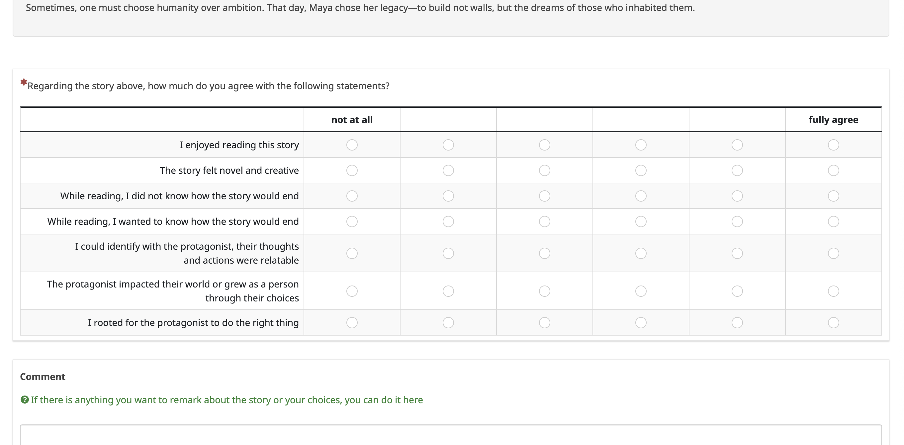

The survey was designed in Limesurvey, with one page per story, containing 
- the full story text first,
- then the mandatory agreement rating for each of the seven dimensions,
- and lastly an optional field for free-text commentary.

The opening participant instructions were: 

> Welcome,
> 
> Thank you for participating in this survey. Our goal is to evaluate the quality of flash fiction stories with different settings.
> 
> On the following pages, please read six short stories and rate them for enjoyment. For each story, you will be asked if you agree or do not agree with seven claims on their quality in different dimensions, for example "I enjoyed reading this story". Please rate each claim from the lowest score to the left (no agreement) to the highest on the right (fully agree with the claim). Each story should be rated independently.

We also asked for prolific ID and removed answers that took too little time or rated everything the same value consistently. Payment was set to the default 9£ per hour. 
